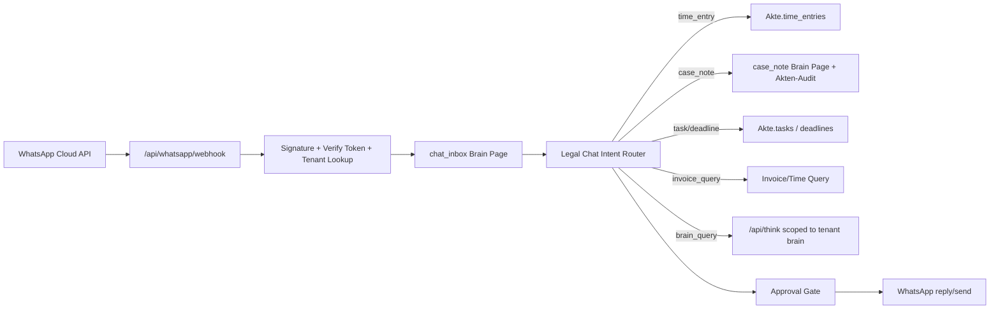

# Kanzlei OS WhatsApp + Superbrain Blueprint

Stand: 2026-06-13

## Ziel

Anwälte sollen unterwegs per WhatsApp mit dem Kanzlei-Superbrain arbeiten:

- Zeiten erfassen: "20 Minuten Telefonat Müller wegen Vergleich zu Akt 24/018"
- Aktennotizen speichern: "Notiz zu Schneider: Gegner bietet 8.000 EUR, Frist bis Freitag"
- Aufgaben und Fristen anlegen: "Reminder morgen 9 Uhr: Klageentwurf prüfen"
- Rechnungs-/Verrechnungsstatus abfragen: "Was ist bei Akt Meier offen abrechenbar?"
- Aktenkontext abrufen: "Fasse mir Akt Müller in 5 Punkten zusammen"
- Spracheingaben/Sprachnachrichten transkribieren und strukturiert ablegen
- Optional Mandantenkommunikation trennen: interner Anwalt-Chat vs. Mandanten-WhatsApp

Das darf kein allgemeiner "ChatGPT in WhatsApp" sein, sondern ein kanzleispezifischer Business-Assistent für die eigenen Kanzleidaten und Workflows.

## Recherche-Kurzstand

- WhatsApp Business Platform/Cloud API empfängt Ereignisse über HTTPS-Webhooks und sendet Nachrichten über die Graph API.
- Webhook-Setup benötigt GET-Verifikation mit Verify Token und POST-Verarbeitung der WhatsApp-Events.
- WhatsApp Business Platform nutzt message-/category-basiertes Pricing; Kosten hängen von Markt und Nachrichtentyp ab.
- Meta/WhatsApp Terms sind bei KI-Agenten sensibel: allgemeine AI-Assistenten sind policy-riskant. Kanzleispezifische Workflow-, Support- und CRM-ähnliche Business-Fälle sind der sichere Zielkorridor.
- Für Datenschutz/Berufsgeheimnis muss die Kanzlei bewusst opt-in konfigurieren. WhatsApp ist Transportkanal, nicht alleiniger System of Record. System of Record bleibt Superbrain.

## Architekturentscheidung

Wir bauen einen eigenen Connector, nicht nur einen Zapier/Make-Workflow.

Warum:

- Mandatsdaten, Aktennotizen, Zeiten und Rechnungen sind hochsensibel.
- Wir brauchen Tenant-Routing auf `brainId`/Org-Ebene.
- Wir müssen jede empfangene Nachricht auditieren, deduplizieren und in eine sichere Intent-Pipeline geben.
- Wir brauchen Freigabe- und Bestätigungsflüsse, bevor kritische Schreiboperationen passieren.

## Zielarchitektur



## Datenmodell

### `chat_connector_settings`

Slug: `legal/settings/connectors/whatsapp`

Frontmatter:

```yaml
type: chat_connector_settings
provider: whatsapp
enabled: true
phone_number_id: "..."
waba_id: "..."
business_display_name: "Kanzlei ..."
allowed_senders:
  - phone: "+43..."
    user_id: "..."
    role: lawyer
default_jurisdiction: de
mode: lawyer_internal
created_at: "..."
updated_at: "..."
```

Secrets bleiben in Env/secret store, nicht in Brain-Frontmatter:

- `WHATSAPP_VERIFY_TOKEN`
- `WHATSAPP_APP_SECRET`
- `WHATSAPP_ACCESS_TOKEN`
- `WHATSAPP_PHONE_NUMBER_ID`

### `chat_inbox`

Slug: `legal/chat/whatsapp/{wamid}`

Frontmatter:

```yaml
type: chat_inbox
provider: whatsapp
message_id: wamid...
from_phone_hash: sha256...
from_user_id: user_...
tenant_brain_id: brain_...
direction: inbound
message_type: text
received_at: "..."
status: received
intent: time_entry
case_slug: legal/cases/...
requires_confirmation: true
processed_at:
error:
```

Content:

```md
Original:
20 Minuten Telefonat Müller wegen Vergleich zu Akt 24/018

Parsed:
- intent: time_entry
- case: legal/cases/24-018-mueller
- minutes: 20
- activity: Telefonat
- billable: true
```

### `chat_action`

Slug: `legal/chat/actions/{id}`

Frontmatter:

```yaml
type: chat_action
provider: whatsapp
message_slug: legal/chat/whatsapp/...
intent: time_entry
status: pending_confirmation
target_slug: legal/cases/...
payload:
  minutes: 20
  description: Telefonat wegen Vergleich
  activity_type: Telefonat
  billable: true
confirmation_token: short-lived
expires_at: "..."
```

## Intent-System

### Phase 1: sichere Kommandos

Deterministisch, wenig KI:

- `zeit`: Zeit erfassen
- `notiz`: Aktennotiz speichern
- `aufgabe`: Aufgabe anlegen
- `frist`: Frist/Termin vorschlagen
- `suche`: Brain-Suche
- `status`: Akten- oder Rechnungsstatus
- `hilfe`: verfügbare Befehle

Beispiele:

```text
zeit 20m akt 24/018 telefonat mit mandant wegen vergleich
notiz akt müller gegner bietet 8000 eur, rückmeldung bis freitag
status akt 24/018 abrechnung
suche letzte notizen zu schneider vergleich
```

### Phase 2: natürlichsprachlicher Router

LLM/Parser klassifiziert:

```ts
type LegalChatIntent =
  | { kind: "time_entry"; caseRef: string; minutes: number; description: string; activityType?: string; billable?: boolean }
  | { kind: "case_note"; caseRef: string; note: string; visibility: "internal" | "client" }
  | { kind: "task"; caseRef?: string; title: string; dueDate?: string }
  | { kind: "deadline"; caseRef: string; title: string; dueDate: string; law?: string }
  | { kind: "invoice_query"; caseRef?: string; clientRef?: string }
  | { kind: "brain_query"; query: string }
  | { kind: "unknown"; clarification: string };
```

### Bestätigungsregel

Schreibende Actions sind zweistufig:

1. System antwortet: "Ich habe erkannt: 20 Minuten Telefonat zu Akt Müller als abrechenbar. Antworten mit JA zum Speichern."
2. Erst bei `JA`, `ok`, `speichern` wird in Akte/Brain geschrieben.

Ausnahmen optional konfigurierbar:

- Interne eigene Zeitbuchung darf bei vertrauenswürdigem Anwalt direkt gespeichert werden.
- Fristen, Mandantenkommunikation und Rechnungsversand brauchen immer Confirmation.

## Bestehende Architektur-Anbindung

### Neue API-Routen

- `GET /api/whatsapp/webhook`
  - Meta Verify Token Challenge.
- `POST /api/whatsapp/webhook`
  - HMAC/App-Secret-Signatur prüfen.
  - Webhook deduplizieren.
  - Tenant/User anhand Phone Number und Connector Settings finden.
  - Raw Event als `chat_inbox` Brain Page speichern.
  - Intent Pipeline starten.

- `POST /api/whatsapp/send`
  - Nur serverseitig/Worker.
  - Sendet Antwort über Graph API.
  - Loggt Outbound als `chat_inbox` direction=`outbound`.

### Neue Libraries

- `src/lib/whatsapp/types.ts`
- `src/lib/whatsapp/verify.ts`
- `src/lib/whatsapp/send.ts`
- `src/lib/legal-chat-intents.ts`
- `src/lib/legal-chat-actions.ts`

### Wiederverwendung bestehender Funktionen

- Akten: `legal_case` Frontmatter (`time_entries`, `expenses`, `tasks`, `deadlines`, `audit_log`)
- Kontakte: `legal_contact`
- Rechnungen: `invoice`
- Kanzlei-Settings: `legal/settings/kanzlei`
- Offline/Queue: Browserseitig bleibt unverändert; WhatsApp ist serverseitig cloud-first.
- Tenant-Routing: `engineHeadersForBrain(brainId)` für bekannte Tenant-Zuordnung.

## Kanzlei-Workflows

### Zeit erfassen

Input:

```text
20 min Telefonat mit Huber zu Akt 2026-014 wegen Vergleich
```

Pipeline:

1. Phone -> User/Anwalt.
2. Case resolver sucht `case_number`, `client_name`, `opponent_name`, Slug.
3. System fragt bei Mehrdeutigkeit nach.
4. Schreibt `time_entries[]` in Akte:

```yaml
time_entries:
  - id: uuid
    date: now
    minutes: 20
    description: Telefonat mit Huber wegen Vergleich
    activity_type: Telefonat
    lawyer: Anwalt Name
    billable: true
    billed: false
    source: whatsapp
```

Antwort:

```text
Gespeichert: 20 min Telefonat zu Akt 2026-014, abrechenbar, noch nicht verrechnet.
```

### Aktennotiz

Input:

```text
Notiz Müller: Mandant will Vergleich nur ab 12.000 akzeptieren.
```

Speicherung:

- `legal/cases/...` audit_log ergänzen.
- Zusätzlich `legal/notes/{case}/{id}` als eigene Brain Page für bessere Suche.

### Rechnung/Verrechnung abfragen

Input:

```text
Was ist bei Müller offen abrechenbar?
```

Antwort:

```text
Akt Müller:
- 3 offene Zeiteinträge: 95 min
- offene Auslagen: 42,30 EUR
- letzte Rechnung: R-2026-0008, gesendet, 1.280 EUR offen
```

### Sprachmemo

Phase 2:

1. WhatsApp Media Webhook empfängt Audio.
2. Server lädt Media über WhatsApp Graph API.
3. Transkription.
4. Gleiche Intent Pipeline wie Text.
5. Original-Media-Referenz wird nicht dauerhaft unverschlüsselt gespeichert.

## Compliance/Security

Pflicht:

- Opt-in pro Kanzlei und pro Nutzer.
- Kein Mandatsgeheimnis an unbekannte Nummern.
- Phone Numbers nur gehasht oder verschlüsselt speichern.
- Signaturprüfung für Webhooks.
- Idempotenz über WhatsApp `wamid`.
- Rate Limits pro Sender.
- Audit-Log jeder Action.
- Confirmation Gate für kritische Writes.
- Data Processing Agreement/Datenschutztext für WhatsApp/Meta als Transportanbieter prüfen.

Nicht tun:

- Kein allgemeiner "Frag alles"-AI-Bot.
- Keine vertraulichen Vollakten ungefragt per WhatsApp ausgeben.
- Keine Rechnungen/Mandantendaten an nicht verifizierte Nummern.
- Kein Versand an Mandanten ohne explizites Consent/Template-Konzept.

## Implementierungsplan

### Sprint 1: Internal Lawyer MVP

1. Env + Settings UI für WhatsApp Connector.
2. `GET/POST /api/whatsapp/webhook`.
3. Inbound Text speichern als `chat_inbox`.
4. Deterministische Kommandos: `zeit`, `notiz`, `status`, `hilfe`.
5. Confirmation Flow.
6. Outbound Antwort senden.
7. Tests für Verify Token, HMAC, Dedupe, Intent Parsing, Time Entry Write.

### Sprint 2: Natural Language + Voice

1. LLM Intent Router mit JSON Schema.
2. Case Resolver mit Mehrdeutigkeitsfragen.
3. Audio Download + Transkription.
4. Fristen/Aufgaben.
5. Error Recovery: "Ich finde den Akt nicht, meinst du A oder B?"

### Sprint 3: Mandantenkommunikation

1. Separater Modus `client_channel`.
2. Mandanten-Opt-in und Nummernprüfung.
3. Templates für Terminerinnerungen, Dokumentenanforderungen, Rechnungslink.
4. Portal-Link statt Vollinhalt.
5. Human handoff.

### Sprint 4: Automatisierung

1. Tägliche Zusammenfassung per WhatsApp an Anwalt.
2. Offene Zeiten "Hast du heute 14:00-15:00 zu Müller gearbeitet?"
3. Fristenwarnungen.
4. Rechnungsvorschläge.

## Offene Produktentscheidung

Empfehlung: Start nur mit internem Anwalt-WhatsApp, nicht mit Mandanten-WhatsApp.

Begründung:

- Weniger Datenschutz-/Consent-Risiko.
- Höherer Nutzen im Tagesgeschäft.
- Schnellere Einführung.
- Mandantenkommunikation braucht Templates, Opt-in, Portal-Verknüpfung und strengere Freigaben.

## Quellen

- Meta WhatsApp Webhooks: https://developers.facebook.com/documentation/business-messaging/whatsapp/webhooks/overview/
- Meta WhatsApp Cloud API Get Started: https://developers.facebook.com/documentation/business-messaging/whatsapp/get-started
- Meta WhatsApp Platform overview: https://developers.facebook.com/documentation/business-messaging/whatsapp/about-the-platform
- Meta WhatsApp Pricing: https://developers.facebook.com/documentation/business-messaging/whatsapp/pricing
- WhatsApp Business Messaging Policy: https://whatsappbusiness.com/policy/
- WhatsApp Business Solution Terms: https://www.whatsapp.com/legal/business-solution-terms
- Meta AI-provider pricing/policy note: https://developers.facebook.com/documentation/business-messaging/whatsapp/pricing/ai-providers/
