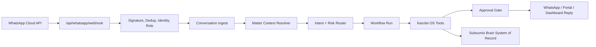

# WhatsApp-First Kanzlei OS Integration Plan

Stand: 2026-06-20

## Zielbild

Subsumio soll nicht als "ChatGPT in WhatsApp" positioniert werden, sondern als
WhatsApp-first Kanzlei-Betriebssystem fuer DACH-Kanzleien:

1. WhatsApp ist der schnellste Eingang fuer Anwalt, Assistenz und optional Mandant.
2. Subsumio erkennt Akte, Rolle, Intent, Risiko und benoetigte Freigabe.
3. Jede Nachricht wird als Matter-Kontext, Dokument, Zeit, Frist, Aufgabe,
   Intake, Portal-Nachricht oder Rechnungsvorgang im Kanzlei-OS gespeichert.
4. Kritische Aktionen laufen ueber Approval Gates und Audit Trail.
5. Der System of Record bleibt Subsumio Brain / Engine, nicht WhatsApp.

Der USP lautet damit:

> Das erste DACH-Kanzlei-OS, das WhatsApp vollwertig in Akten, Fristen,
> Zeiterfassung, Rechnungen, Mandantenportal, Dokumentenanforderungen und
> Legal-AI-Workflows integriert.

## Warum das defensible ist

Globale Practice-Management-Systeme wie Filevine, Clio, MyCase, Lawcus und
Smokeball decken viele Kanzlei-OS-Module ab. Harvey, Legora und Filevine LOIS
gehen stark in Agenten und Legal-AI-Workflows. WhatsApp erscheint bei diesen
Systemen aber meist als externe Integration oder Client-Communication-Kanal,
nicht als nativer, matter-aware Workflow-Eingang.

Subsumio hat lokal bereits die seltene Kombination:

- WhatsApp Webhook, Verify Token, HMAC-Signatur, Allowlist, Dedup und Outbound.
- Voice-/Media-Pipeline mit Transkription und Vault-Speicherung.
- Legal Chat Intent Router fuer Zeit, Notiz, Aufgabe, Frist, Aktenstatus,
  Kollisionspruefung, Dokumentensuche, Rechnung und Aktenanlage.
- Matter Context Engine, Akten, Fristen, Time Tracking, Invoicing, DATEV,
  DocuSign, Portal, DMS, beA, Audit und Workflows.
- DACH-spezifische Rechts-, Fristen-, GoBD-, beA- und Datenschutz-Positionierung.

Die Produktluecke ist nicht "noch ein Modul", sondern die Integration dieser
Bausteine in einen durchgehenden WhatsApp-first Workflow.

## Produktprinzipien

- WhatsApp ist Eingang, nicht Datenbank.
- Jede eingehende Nachricht wird einer Rolle zugeordnet: Anwalt, Assistenz,
  Mandant, Gegner/extern, unbekannt.
- Jede Nachricht wird einer Akte oder einem Intake zugeordnet, oder explizit als
  unzugeordnet markiert.
- Jede schreibende Aktion hat einen Risiko-Level.
- Hochriskante Aktionen brauchen menschliche Freigabe.
- Mandantenkommunikation ist strikt getrennt vom internen Anwalt-Chat.
- AI antwortet quellengeerdet und kennzeichnet Unsicherheit.
- Datenschutz und Berufsgeheimnis sind Produktfeatures, nicht Footnotes.

## Existierende Codebasis

| Capability            | Vorhandener Einstieg                                                          |
| --------------------- | ----------------------------------------------------------------------------- |
| WhatsApp Webhook      | `src/app/api/whatsapp/webhook/route.ts`                                       |
| WhatsApp Domain Types | `src/lib/whatsapp/types.ts`                                                   |
| Sender Identity       | `src/lib/whatsapp/identity.ts`, `src/lib/whatsapp/identity-store.ts`          |
| Outbound Gate         | `src/lib/whatsapp/outbound-gate.ts`, `src/lib/whatsapp/proactive-send.ts`     |
| Media + Voice         | `src/lib/whatsapp/media.ts`, `src/lib/whatsapp/transcribe.ts`                 |
| Intent Router         | `src/lib/legal-chat/actions.ts`                                               |
| WhatsApp Dashboard    | `src/app/dashboard/whatsapp/page.tsx`                                         |
| Matter Context        | `src/lib/matter-context.ts`, `src/app/api/matter-context/[caseSlug]/route.ts` |
| Workflows             | `src/lib/workflow.ts`, `src/app/api/workflows/route.ts`                       |
| Approvals             | `src/lib/approval.ts`, `src/app/api/approvals/route.ts`                       |
| Time Tracking         | `src/lib/time-tracking.ts`, `src/app/api/time/route.ts`                       |
| Invoicing             | `src/app/api/invoices/*`, `src/app/dashboard/invoicing/page.tsx`              |
| Portal                | `src/app/portal/[token]/page.tsx`, `src/app/api/portal/*`                     |
| Legal AI APIs         | `src/app/api/legal/*`                                                         |
| Audit                 | `src/lib/audit.ts`, `src/app/api/audit/route.ts`                              |

## Integration Spine

Die zentrale Architektur wird eine neue Orchestrierungsschicht zwischen
WhatsApp-Webhook und den bestehenden Kanzlei-OS-Modulen.



Neue Kernkomponente:

`src/lib/whatsapp-kanzlei-os/orchestrator.ts`

Aufgabe:

1. Sender identifizieren und Rolle bestimmen.
2. Nachricht normalisieren: Text, Voice-Transkript, Media, Location, Contact.
3. Konversation als `conversation_event` speichern.
4. Akte oder Intake aufloesen.
5. Intent klassifizieren und Risiko bestimmen.
6. Workflow Run oder direkte Tool-Aktion starten.
7. Antwort formulieren.
8. Audit und Metrics schreiben.

## Neue Domain-Objekte

### `conversation_event`

Zweck: kanonisches Nachrichtenprotokoll fuer WhatsApp, Portal, Email und spaeter
Telefon/Voice.

Frontmatter:

```yaml
type: conversation_event
channel: whatsapp
provider_message_id: wamid...
direction: inbound
role: lawyer | assistant | client | external | unknown
actor_id: user_...
phone_hash: sha256...
case_slug: legal/cases/...
intake_slug: legal/intake/...
message_type: text | voice | image | document | location | contact
normalized_text: "..."
language: de
intent: time_entry
risk_level: low | medium | high | critical
status: received | routed | action_pending | executed | failed
created_at: "..."
```

Migration path: bestehende `chat_inbox` und `chat_outbox` bleiben kompatibel,
werden aber mittelfristig als channel-spezifische Views auf
`conversation_event` behandelt.

### `intake_request`

Zweck: Mandanten-/Lead-Eingang aus WhatsApp, Portal oder Web-Form.

Frontmatter:

```yaml
type: intake_request
source: whatsapp
status: new | needs_info | conflict_check | accepted | rejected | converted
client_name: "..."
phone_hash: sha256...
legal_area: civil
summary: "..."
missing_documents:
  - vollmacht
  - bescheid
conflict_check_status: pending | clear | conflict | needs_review
converted_case_slug:
created_at: "..."
```

### `workflow_run`

Zweck: einheitliche Ausfuehrungsschicht fuer WhatsApp, Dashboard und Agenten.

Frontmatter:

```yaml
type: workflow_run
template_id: whatsapp_intake_to_case
status: running | blocked | completed | failed
trigger_channel: whatsapp
trigger_event_slug: conversation/...
case_slug:
intake_slug:
steps:
  - id: resolve_actor
    status: completed
  - id: conflict_check
    status: pending_approval
  - id: create_case
    status: pending
approval_action_slug:
started_at: "..."
completed_at:
```

Migration path: vorhandene `workflow` Pages aus `src/lib/workflow.ts` bleiben,
aber das Modell wird um Trigger, Artefakte, Approval und Tool-Ergebnisse
erweitert.

### `document_request`

Zweck: automatische Dokumentenanfrage an Mandanten mit Portal/WhatsApp-Link.

Frontmatter:

```yaml
type: document_request
case_slug: legal/cases/...
recipient_role: client
channel: whatsapp
status: draft | sent | partially_fulfilled | fulfilled | expired
items:
  - key: vollmacht
    label: "Vollmacht"
    required: true
    received_document_slug:
portal_token_id:
created_at: "..."
sent_at:
```

## Rollen- und Kanaltrennung

### Interner Anwalt-WhatsApp

Ziel: schnelle Arbeitserfassung und Aktenabfrage.

Erlaubt:

- Zeit und Auslagen erfassen.
- Aktennotizen speichern.
- Aufgaben und Fristen vorschlagen.
- Aktenstatus und offene Abrechnung abfragen.
- Voice Notes in Aktenkontext umwandeln.
- Dokumente/Fotos zur Akte speichern.

Default:

- Low-risk Schreibaktionen duerfen nach explizitem "JA" ausgefuehrt werden.
- Fristen bleiben `review_status=unreviewed`.
- Mandantenkommunikation wird nie direkt aus internem Chat versendet.

### Mandanten-WhatsApp

Ziel: Intake, Dokumente, Rueckfragen, Status-Updates.

Erlaubt:

- Intake starten.
- Dokumente hochladen.
- Rueckfragen beantworten.
- Portal-Link erhalten.
- Status-Update anfordern, soweit Kanzlei freigegeben.

Default:

- Kein freier Zugriff auf den Brain.
- Keine ungepruefte Rechtsberatung.
- Jede AI-Antwort an Mandanten hat Template/Policy-Guard und ggf. Freigabe.

### Assistenz-WhatsApp

Ziel: operative Kanzlei-Arbeit.

Erlaubt:

- Termine, Aufgaben, Dokumentenanfragen, Rechnungsentwuerfe vorbereiten.
- Intake triagieren.
- fehlende Unterlagen nachfassen.

Default:

- Keine rechtliche Bewertung ohne Anwalt-Freigabe.

## Intent- und Risiko-Matrix

| Intent                   | Kanal            |   Risiko | Default-Verhalten                     |
| ------------------------ | ---------------- | -------: | ------------------------------------- |
| `time_entry`             | intern           |      low | WhatsApp-Bestaetigung reicht          |
| `expense`                | intern           |      low | WhatsApp-Bestaetigung reicht          |
| `case_note`              | intern           |      low | WhatsApp-Bestaetigung reicht          |
| `media_upload`           | intern/client    |      low | speichern, Aktenzuordnung bestaetigen |
| `case_summary`           | intern           |   medium | nur fuer berechtigte Rollen           |
| `document_fetch`         | intern           |   medium | nur Metadaten/Link, kein Leak         |
| `deadline`               | intern           |     high | Approval oder Fristen-Review          |
| `create_case`            | intern/assistant |   medium | Kollisionspruefung zuerst             |
| `close_case`             | intern           |     high | Dashboard/Approval erforderlich       |
| `create_invoice`         | intern/assistant |     high | Rechnung nur als Entwurf              |
| `message_send_client`    | intern/assistant | critical | Anwalt-Freigabe immer                 |
| `legal_advice_to_client` | client           | critical | nie autonom, Entwurf fuer Anwalt      |
| `conflict_check`         | alle             |     high | Ergebnis nie als final ohne Review    |

## Kern-Workflows

### 1. Anwalt Voice Note zu abrechenbarer Arbeit

Beispiel:

> "20 Minuten Telefonat mit Mueller zu Akt 2026-014 wegen Vergleich, bitte abrechnen"

Flow:

1. WhatsApp Voice kommt in `/api/whatsapp/webhook`.
2. Media wird gespeichert, Voice transkribiert.
3. Orchestrator schreibt `conversation_event`.
4. Matter Resolver findet `legal/cases/2026-014`.
5. Intent `time_entry`, risk `low`.
6. System antwortet mit Zusammenfassung und "JA zum Speichern".
7. Bei JA schreibt Tool in `time_entries`.
8. Audit Log + Outbox + SSE Update.

Akzeptanzkriterien:

- Voice-Datei und Transkript sind im Vault nachvollziehbar.
- Zeitbuchung enthaelt `source=whatsapp`, actor, message id.
- Doppelte WhatsApp Events erzeugen keine doppelte Zeitbuchung.
- Mehrdeutige Akten fragen nach Auswahl statt falsch zu buchen.

### 2. Mandant Intake zu neuer Akte

Beispiel:

> "Ich habe eine Kuendigung bekommen, Frist laeuft morgen."

Flow:

1. Unbekannte oder mandantische Nummer wird nicht abgewiesen, sondern in
   `intake_request` geroutet, sofern Mandanten-WhatsApp fuer die Kanzlei aktiv ist.
2. AI Secretary fragt minimal nach: Name, Gegner, Dokument, Datum, Einwilligung.
3. Uploads werden in `legal/documents/intake/...` gespeichert.
4. Konfliktcheck wird gestartet.
5. Bei `clear` wird ein `create_case` Approval fuer Anwalt/Assistenz erzeugt.
6. Nach Freigabe entsteht `legal_case` mit verknuepftem Intake und Dokumenten.
7. Mandant erhaelt Portal-Link oder bestaetigte Empfangsnachricht.

Akzeptanzkriterien:

- Mandant bekommt keine Rechtsberatung ohne Freigabe.
- Intake erzeugt keine Akte ohne Kollisionspruefung.
- Alle Dokumente sind hashbar und dem Intake zugeordnet.
- Conversion von Intake zu Akte ist auditierbar.

### 3. Automatische Dokumentenanfrage

Beispiel intern:

> "Fordere bei Akt 2026-014 Vollmacht und Bescheid an"

Flow:

1. Intent `document_request`, risk `critical` wegen Mandantenkontakt.
2. Draft `document_request` wird erstellt.
3. Anwalt sieht Nachrichtenvorschlag in Approval Queue.
4. Nach Freigabe sendet System WhatsApp Template oder Portal-Link.
5. Mandant laedt Dokumente hoch.
6. Dokumente werden Vault + Akte + Matter Context zugeordnet.

Akzeptanzkriterien:

- Versand nur innerhalb WhatsApp-Regeln: 24h window oder approved template.
- Freigabe zeigt Empfaenger, Text, Dokumentliste und Akte.
- Upload erfuellt Request Item und aktualisiert Status.

### 4. Frist aus Mandanten-/Anwalt-WhatsApp

Beispiel:

> "Bescheid zugestellt am 12.06.2026, Rechtsmittelfrist pruefen"

Flow:

1. Intent `deadline_calc` oder `deadline`.
2. Legal deadline engine berechnet Kandidat.
3. Frist wird als `review_status=unreviewed` vorgeschlagen.
4. Approval Action `deadline_create`.
5. Nach Freigabe landet Frist in Akte und Kalender/Reminder.

Akzeptanzkriterien:

- Nie automatisch als final freigegeben.
- Berechnungsregel und Startdatum werden gespeichert.
- Reminder-Job erkennt neue Frist.

### 5. Offene Leistungen zu Rechnung

Beispiel:

> "Was ist bei Akt 2026-014 offen abrechenbar?"

Flow:

1. Intent `invoice_status`.
2. Time Tracking liest offene `time_entries` und `expenses`.
3. Antwort listet Summe, offene Eintraege und naechste Aktion.
4. "Rechnung vorbereiten" erzeugt Draft Invoice.
5. Versand bleibt Approval/Dashboard.

Akzeptanzkriterien:

- Keine Rechnung wird direkt an Mandant gesendet.
- Draft verlinkt alle gebuchten Leistungen.
- Mark-billed passiert erst nach finaler Rechnung.

## Technische Arbeitspakete

### P0.1 Orchestrator einfuehren

Dateien:

- Neu: `src/lib/whatsapp-kanzlei-os/orchestrator.ts`
- Neu: `src/lib/whatsapp-kanzlei-os/risk.ts`
- Neu: `src/lib/whatsapp-kanzlei-os/events.ts`
- Aendern: `src/app/api/whatsapp/webhook/route.ts`
- Aendern: `src/lib/legal-chat/actions.ts`

Tasks:

1. `processMessage` im Webhook auf Orchestrator umleiten.
2. Legacy `handleLegalChatMessage` als Tool hinter Orchestrator behalten.
3. Kanonisches `conversation_event` schreiben.
4. Einheitliches Result-Schema:

```ts
type OrchestrationResult = {
  reply: string | null;
  eventSlug: string;
  workflowRunSlug?: string;
  actionSlug?: string;
  status:
    | "ignored"
    | "routed"
    | "pending_confirmation"
    | "pending_approval"
    | "executed"
    | "failed";
};
```

### P0.2 Rollenmodell und Sender Routing

Dateien:

- Aendern: `src/lib/whatsapp/types.ts`
- Aendern: `src/lib/whatsapp/identity-store.ts`
- Aendern: `src/app/api/whatsapp/status/route.ts`
- Aendern: `src/app/dashboard/whatsapp/page.tsx`

Tasks:

1. `WhatsAppIdentity.role` erweitern: `client`, `external`, `intake`.
2. `mode`: `lawyer_internal`, `client_intake`, `hybrid`.
3. Matter Scope erzwingen, bevor Brain Query oder Dokumentenzugriff erfolgt.
4. Dashboard zeigt interne Nummern, Mandantenkanal, offene Intakes.

### P0.3 Matter Context Resolver

Dateien:

- Neu: `src/lib/whatsapp-kanzlei-os/matter-resolver.ts`
- Wiederverwenden: `src/lib/matter-context.ts`
- Wiederverwenden: `findCaseCandidates` aus `src/lib/legal-chat/actions.ts`

Tasks:

1. Akte aus Aktenzeichen, Name, Caption, Thread History und Sender Scope finden.
2. Bei Mehrdeutigkeit structured choices per WhatsApp List senden.
3. Unzuordenbare Mandanten-Nachrichten als Intake statt Brain Query routen.

### P0.4 Approval Bridge

Dateien:

- Aendern: `src/lib/approval.ts`
- Aendern: `src/app/api/approvals/route.ts`
- Aendern: `src/lib/workflow.ts`
- Aendern: `src/app/api/workflows/route.ts`

Tasks:

1. Action Types erweitern:
   - `case_create`
   - `case_close`
   - `invoice_create`
   - `client_message_send`
   - `document_request_send`
   - `deadline_confirm`
2. Approval Action muss `payload`, `source_event_slug`, `workflow_run_slug`
   speichern.
3. Approval PATCH triggert optional Tool-Ausfuehrung, nicht nur Statuswechsel.

### P0.5 Demo Workflow hart machen

Ziel-Demo:

1. Voice Note: Zeit buchen.
2. Dokument per WhatsApp zur Akte speichern.
3. Mandant fragt Status.
4. Anwalt fordert Unterlagen an.
5. Mandant laedt Unterlage hoch.
6. System bereitet Rechnung vor.

Tasks:

- Seed-Demo-Daten fuer eine Kanzlei und eine Akte.
- Playwright E2E fuer Webhook Payloads.
- Dashboard-WhatsApp zeigt Timeline statt nur Logs.
- Demo-Script in `docs/designs/WHATSAPP_FIRST_DEMO_SCRIPT.md`.

## P1 Erweiterungen

### Natural Language Intake

- `intake_request` CRUD API.
- Rechtsgebiets-spezifische Fragen.
- Kollisionspruefung als Pflichtstep.
- Conversion zu `legal_case`.

### Document Request Loop

- `document_request` API.
- Portal token reuse.
- WhatsApp template handling.
- Fulfillment status im Matter Context.

### Unified Conversation Timeline

- Aktenseite zeigt WhatsApp, Portal, Email, beA und Notizen chronologisch.
- Jede Zeile hat Quelle, Actor, Risk, Status, verknuepfte Aktion.

### Secretary Metrics

Vorhanden: `src/lib/whatsapp/secretary-metrics.ts`,
`src/app/api/legal/secretary-metrics/route.ts`.

Erweitern um:

- Zeit bis Intake-Antwort.
- Dokumentenanfragen offen/erfuellt.
- gesparte manuelle Minuten.
- Pending approvals.
- WhatsApp Kosten pro Mandat.

## Compliance und WhatsApp Policy

Meta beschraenkt AI Provider und general-purpose AI auf WhatsApp Business. Subsumio
muss deshalb produktseitig klar im erlaubten Business-Automation-Korridor bleiben:

- AI ist ancillary zur Kanzlei-Dienstleistung, nicht das primaere WhatsApp-Produkt.
- Antworten sind mandats- und kanzleispezifisch, nicht general-purpose.
- Mandanten erhalten keine offene allgemeine AI.
- Business Solution Data wird nicht fuer allgemeines Modelltraining genutzt.
- EEA/Brazil-Ausnahmen nicht als Kernstrategie verwenden.
- Templates und 24h Customer Service Window werden technisch erzwungen.

Konkrete Controls:

- Feature Flag `WHATSAPP_CLIENT_AI_ENABLED=false` default.
- Mandanten-Antworten nur aus erlaubten Templates oder Approval.
- Outbound Gate prueft 24h window und Template-Kategorie.
- Data Processing Notice in Onboarding.
- Audit Event fuer jede AI-generierte Mandantenantwort.

## API Design

Neue interne APIs:

```http
POST /api/whatsapp/orchestrate
POST /api/intake
PATCH /api/intake/:slug
POST /api/document-requests
PATCH /api/document-requests/:slug
POST /api/workflows/:slug/execute-approved
GET /api/conversations?caseSlug=...
```

Diese koennen schrittweise entstehen. P0 kann direkt im Webhook starten, solange
die Logik in `src/lib/whatsapp-kanzlei-os/*` liegt und testbar bleibt.

## Testplan

### Unit

- Intent + Risk Matrix.
- Matter Resolver: exact match, fuzzy match, ambiguous, no match.
- Role gating: client darf keine Brain Query; lawyer darf scoped Brain Query.
- Outbound Gate: 24h window, template required, denied unknown.
- Approval payload roundtrip.

### Integration

- WhatsApp text -> conversation_event -> chat_action.
- Voice -> media vault -> transcription -> time_entry.
- Media caption with case ref -> legal_document + case.documents.
- Client unknown -> intake_request.
- Approval approve -> tool execution.

### E2E

- Simulierter Meta Webhook mit valid signature.
- Duplicate webhook does not double execute.
- Lawyer demo flow end-to-end.
- Client intake flow end-to-end.
- Mandant versucht Aktenfrage -> denied/safe response.

## 30-Tage Plan

### Woche 1

- Orchestrator Skeleton.
- `conversation_event` schreiben.
- Risk Matrix.
- Webhook auf Orchestrator routen.
- Tests fuer bestehende interne WhatsApp-Kommandos gegen Regression.

### Woche 2

- Rollenmodell + Matter Resolver.
- Intern/Client-Modus trennen.
- Approval payload erweitern.
- Dashboard WhatsApp Timeline MVP.

### Woche 3

- Intake Request MVP.
- Document Request MVP.
- Mandanten-WhatsApp nur Intake + Upload + sichere Statusantwort.
- Outbound Gate mit Template/24h enforce.

### Woche 4

- Demo Flow polish.
- E2E Webhook Tests.
- Secretary Metrics.
- Produktcopy fuer USP:
  "WhatsApp-first Kanzlei-OS: Akten, Fristen, Zeiten, Dokumente und Mandantenkommunikation in einem auditierbaren Brain."

## 60-Tage Plan

- Workflow Run Modell vereinheitlichen.
- Document Request Fulfillment im Portal.
- Akten-Timeline fuer alle Kanaele.
- Rechnung aus offenen Leistungen mit Approval.
- Fristen-Review Queue.
- Kanzlei-Onboarding fuer WhatsApp: Nummer, Rollen, Templates, Consent.

## 90-Tage Plan

- No-code Workflow Templates fuer Kanzlei-Admin.
- Rechtsgebiet-spezifische Intake Playbooks.
- Multi-Kanal Conversation Hub: WhatsApp, Portal, Email, beA.
- Kosten- und Nutzen-Dashboard pro Mandat.
- Partnerfaehige Integrationsseite gegen Clio/Filevine: "Subsumio as WhatsApp AI layer".

## Nicht bauen in Phase 1

- Kein allgemeiner AI-Freund auf WhatsApp.
- Keine autonome Rechtsberatung an Mandanten.
- Kein direkter Rechnungsversand ohne Approval.
- Kein finaler Fristenkalender ohne Review.
- Kein paralleles zweites Portal, sondern vorhandenes Portal erweitern.
- Keine neue Datenbank ausserhalb Brain/Engine, solange Pages reichen.

## Definition of Done fuer den USP

Der USP gilt als produktreif, wenn diese Demo live und wiederholbar funktioniert:

1. Anwalt schickt Voice Note mit Zeitbuchung.
2. Subsumio erkennt Akte, transkribiert, fragt nach Bestaetigung.
3. Nach "JA" ist die Zeit in der Akte und Abrechnung sichtbar.
4. Mandant schickt Dokument per WhatsApp.
5. Dokument landet im Vault, ist der Akte zugeordnet und im Matter Context.
6. Anwalt fordert per WhatsApp fehlende Unterlagen an.
7. System erstellt eine freigabepflichtige Mandantennachricht.
8. Nach Approval wird WhatsApp/Portal-Link gesendet.
9. Offene Zeiten werden zu Rechnungsentwurf aggregiert.
10. Audit Trail zeigt jeden Schritt mit Quelle, Actor, Zeitpunkt und Status.

Wenn diese zehn Schritte stabil laufen, kann Subsumio glaubwuerdig als
WhatsApp-first Kanzlei-OS positioniert werden.
